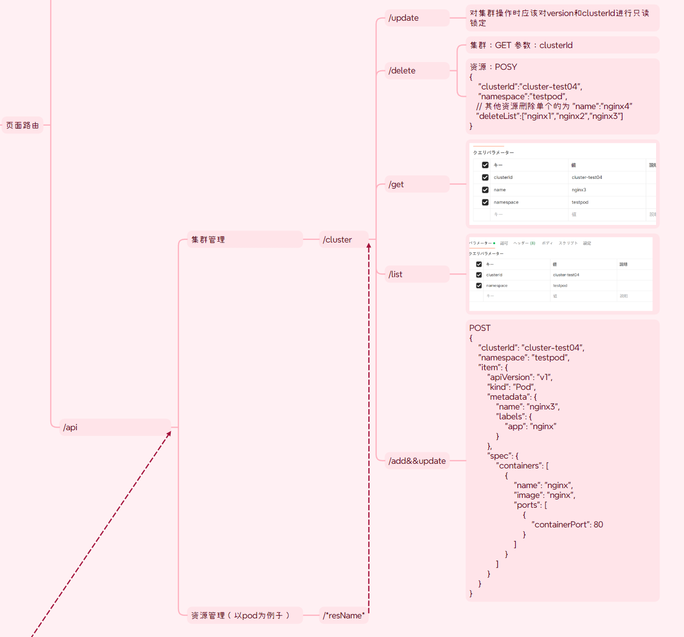

# visibleK8S的后端项目，自用
基于本人名为JWT-TEST的仓库二次开发项目，实现了**多集群**的k8s资源
（cluster, configmap, cronjob, daemonset, deployment, ingress, namespace, node, persistentvolume, persistentvolumeclaim, pod, replicaset, secret, service, statefulset, storageclass）
增删改查，同时实现了用户的登录和注销，以及JWT的验证，便于调试用


```json
数据返回格式:
    状态码
        400 鉴权失败！
        401 出错！
        200 成功！
        404 路由不存在！
        500 不存在资源！
    数据格式
        仅处理请求
            {
        "status": 200,
        "message": "文字提示"
        //错误： "message": "err信息 + 文字提示"
        "data": {
            
        }
    }
        单数据交互
            {
        "status": 200,
        "message": "文字提示",
        //错误： "message": "err信息 + 文字提示"
        "data": {
            item:{
                单内容
            }
        }
    }
        多数据交互
            {
        "status": 200,
        "message": "文字提示",
        //错误： "message": "err信息 + 文字提示"
        "data": {
            items:[
                {
                    内容一
                },
                {
                    内容二
                },
            ]
        }
    }
```

以下是一些介绍：
1. 快速开始：
   - 克隆仓库：
     ```bash
     git@github.com:MoriDreamers/visibleBase.git
   - 安装依赖：
     ```bash
     go mod tidy
   - 环境变量
     ```bash
     export USERNAME=admin
     export PASSWORD=securepassword
     export JWT_SECRET=your-secret-key
     注意还要在kube文件夹下填入你的kubeconfig
   - 运行项目：
     ```bash
     go run ./main.go
2. 路由：
   - /login：登录接口，返回JWT令牌
   - /logout：注销接口，清除JWT令牌
   - /api/资源名字/add 添加资源
   - /api/资源名字/delete 删除资源
   - /api/资源名字/update 更新资源
   - /api/资源名字/get 获取单个资源
   - /api/资源名字/list 获取资源列表
   - *请注意，add，update，delete均为POST，其余为GET方法*
3. 中间件：
   - AUTH中间件：用于验证JWT令牌，只有通过验证的请求才能访问受保护的路由
4. 服务：
   - controllers：用于处理业务逻辑，调用Clientgo进行资源的增删改查操作
   - routers：用于定义HTTP路由和处理函数，调用服务层的方法，返回响应结果
   - midderware：用于定义中间件，如AUTH中间件 
   - utils：此处对logrous进行了封装，用于日志记录，便于调试，接受一个interface{}和一串string，用于接受err参数+文字提示
   - kube：在此处放置了对运行此项目的k8s集群的配置，包括k8s集群的配置文件路径，以及k8s集群的配置信息，包括集群地址，证书路径，token等
   - config：此处放置了项目的配置文件，包括JWT密钥，JWT过期时间等，以及一些全局的配置文件
   - clientStudy：学习用的，没啥用可以删掉
5. 数据库：
   - 本项目没有使用数据库，所有数据都存储在k8s集群中的secret中，使用Clientgo进行资源的增删改查操作
   - 账户密码于config中使用viper配置，读取环境变量的”USERNAME“和”PASSWORD“，默认为”Mori“和”10086“
   - 端口配置同上，默认为8080
6. 一些逻辑介绍：
    - routers的逻辑为： 以ns为例，首先在ns下定义一堆路由方法（/add...）调用根目录下的controllers中的同名文件夹下的处理函数，将其分到一个namespaceGroup（/namespace）组里，在上级目录下的routes.go中导入包，同时再次注册到apiGroup（/api）组，最后在mian.go中注册apiGroup组，完成路由的注册
    - main.go中对总路由进行了注册，同时调用了*_ "visibleBase/controllers/initcontroller"*，这会自动执行包中的函数，实现了对项目核心组件clientgo的初始化
7. 注意事项：
   - *使用了gin jwt/v5 logrus*
   - *main.go中本地调试时取消了跨域限制，请不要在生产环境使用，同时为了便于测试更改了JWT过期时间几乎永久，请注意*
   - *minikube start --embed-certs=true 本地调试内嵌证书生成参数*
   - **本项目仅用于学习和测试目的，任何商业使用或侵权行为与作者无关!**
